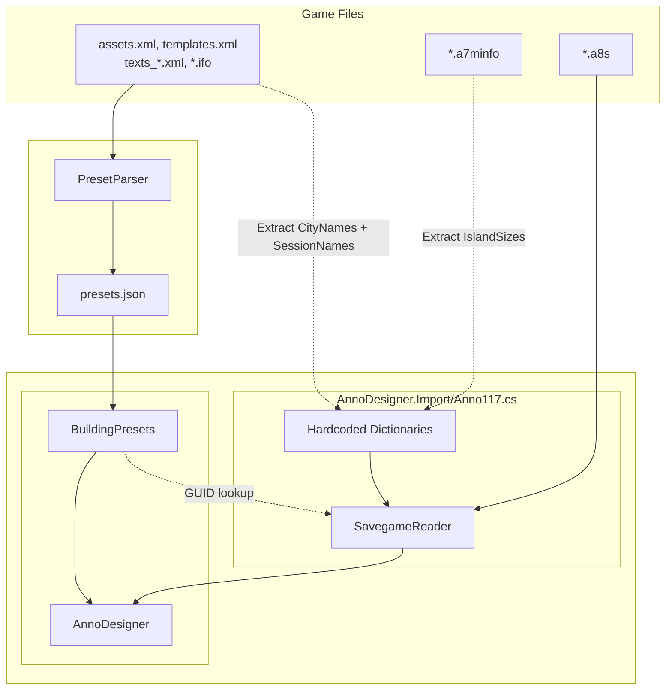

# Anno 117 Assets Documentation

> [!IMPORTANT]  
> This documentation is **work in progress** and may be incomplete or subject to change.

## Overview

This document describes how the PresetParser tool extracts building information from Anno 117 game files to generate JSON preset files for the AnnoDesigner application. The parser reads XML asset definitions from the game's data files, processes building metadata, extracts building dimensions, resolves localization, and outputs structured JSON files that AnnoDesigner uses to provide building presets for layout planning.

**Key Files:**
- Asset data: `data/base/config/export/assets.xml`
- Template definitions: `data/base/config/export/templates.xml`
- Language files: `data/config/base/localizations/texts_*.xml` (different languages)
- Building `.ifo` files: `data/base/graphics/**/*.ifo`

**Related Documentation:**
- For savegame data format, see [Anno117_Savegames.md](Anno117_Savegames.md)

## Table of Contents

1. [Data Sources](#data-sources)
2. [XML Asset Structure](#xml-asset-structure)
3. [Template System](#template-system)
4. [Building Classification](#building-classification)
5. [Population Level Resolution](#population-level-resolution)
6. [Module System (Farm Fields)](#module-system-farm-fields)
7. [Build Blocker Extraction](#build-blocker-extraction)
8. [Coastal Buildings & BlockedArea](#coastal-buildings--blockedarea)
9. [Influence Radius Types](#influence-radius-types)
10. [Localization System](#localization-system)
11. [Data Extraction Pipeline](#data-extraction-pipeline)

## Data Sources

### Primary Data Files

The PresetParser reads building data from several XML files located in the Anno 117 game installation:

| File | Purpose | Location |
|------|---------|----------|
| `assets.xml` | Asset definitions for all game objects | `data/base/config/export/assets.xml` |
| `templates.xml` | Template inheritance definitions | `data/base/config/export/templates.xml` |
| `texts_*.xml` | Localization data | `data/config/base/localizations/texts_*.xml` |
| Building `.ifo` files | BuildBlocker data | `data/base/graphics/**/*.ifo` |

### Asset Database Structure

The `assets.xml` file contains all asset definitions in a hierarchical XML structure. Each `<Asset>` element represents a game object (building, item, unit, etc.)

## XML Asset Structure

### Asset Element Format

Each building asset starts with an `<Asset>` tag and contains two main sections:

```xml
<Asset>
  <Template>TemplateName</Template>
  <Values>
    <!-- All building properties organized by component -->
  </Values>
</Asset>
```

### Core Components

Building assets contain multiple component sections under `<Values>`:

| Component | Description | Key Fields |
|-----------|-------------|------------|
| `Standard` | Basic identification | `GUID`, `Name`, `IconFilename` |
| `Building` | Building-specific information | `AssociatedRegions`, `TerrainType` |
| `Object` | Graphic model references | `Variations/Item/Filename` (`.cfg` files) |
| `Text` | Localization reference | `OasisId` (for localization lookup) |
| `Factory7` | Production buildings | `RawResourceType`, `CycleTime` |
| `Residence7` | Residential buildings | `PopulationLevel`, `NeedsList` |
| `ModuleOwner` | Farm buildings | `ModuleLimits`, `ModuleBuildRadius` |
| `FreeAreaProductivity` | Area production buildings | `InfluenceRadius` |
| `EffectSource` | Public service buildings | `RadiusDistance`, `StreetDistance` |

### Example: Residential Building

```xml
<Asset>
  <Template>ResidenceBuilding</Template>
  <Values>
    <Standard>
      <GUID>3087</GUID>
      <Name>Residence Roman 01 Peasants</Name>
      <IconFilename>data/ui/fhd/base/icon_content/building/icon_3d_base_residence.png</IconFilename>
    </Standard>
    <Building>
      <BuildingType>Residence</BuildingType>
      <AssociatedRegions>Roman</AssociatedRegions>
    </Building>
    <Object>
      <Variations>
        <Item>
          <Filename>data/base/graphics/roman/buildings/residences/residence_tier01_estate01/residence_tier01_estate01.cfg</Filename>
        </Item>
      </Variations>
    </Object>
    <Text>
      <OasisId>-6906069717582254665</OasisId>
    </Text>
    <Residence7>
      <PopulationLevel>1499</PopulationLevel>
    </Residence7>
  </Values>
</Asset>
```

### Example: Production Building

```xml
<Asset>
  <Template>Production</Template>
  <Values>
    <Standard>
      <GUID>2955</GUID>
      <Name>Production Coast Roman Sardines</Name>
      <IconFilename>data/ui/fhd/base/icon_content/production_goods/icon_3d_sardines_goods.png</IconFilename>
    </Standard>
    <Building>
      <TerrainType>Water_Including_Coast</TerrainType>
      <AssociatedRegions>Roman</AssociatedRegions>
    </Building>
    <Object>
      <Variations>
        <Item>
          <Filename>data/base/graphics/roman/buildings/production/coast/sardines/coast_sardines.cfg</Filename>
        </Item>
      </Variations>
    </Object>
    <Text>
      <OasisId>-6905477979738377547</OasisId>
    </Text>
    <Factory7>
      <RawResourceType>Coastal</RawResourceType>
    </Factory7>
  </Values>
</Asset>
```

## Template System

### Template as Building Type

The `<Template>` element defines the building's base type and determines which component sections are available. Templates provide inheritance and define the structure of the building's data.

### Common Building Templates

| Template | Description |
|----------|-------------|
| `ResidenceBuilding` | Player housing (all tiers) |
| `Production` | Standard production buildings |
| `Production Field` | Farm buildings with module support |
| `Production Area` | Area production buildings (Woodcutter, Resin Trapper, etc.) |
| `Module Field` | Farm field modules |
| `Warehouse` | Storage buildings |
| `PublicServiceBuilding` | Service buildings (Market, Tavern, etc.) |
| `CityInstitutionBuilding` | Large public buildings (Forum, Temple) |
| `Monument` | Large monuments with construction phases |
| `MilitaryWall` | Defensive walls |
| `MilitaryGate` | Gates in defensive walls |
| `MilitaryTowerUnit` | Defensive towers |
| `SlotFactoryBuilding7` | Mines and river buildings |
| `AqueductProducer` | Aqueduct Source |
| `AqueductConnector` | Aqueduct |
| `AqueductDistributor` | Aqueduct Cistern |
| `VillaUrban` | Govenor Villa |
| `GuestHouse` | Officium |

## Building Classification

### Classification Fields

| Field | Description | Example Values |
|-------|-------------|----------------|
| `Header` | Game version identifier | `(A8) Anno 117` |
| `Faction` | Population tier or category | `(1) Liberti`, `(2) Plebeians`, `Harbor`, `Residences` |
| `Group` | Sub-category within faction | `Production Buildings`, `Farm Buildings`, `(1) Roman` |
| `Template` | Base template type | `Production`, `ResidenceBuilding` |
| `Identifier` | Display name (English) | `Wheat Farm`, `Patricians` |

### Classification Hierarchy

Buildings are classified into a three-tier hierarchy for organization in AnnoDesigner:

```
Header → Faction → Group
```

Complete building classification tree for Anno 117:

```
(A8) Anno 117
├── (1) Liberti
│   ├── Farm Buildings
│   ├── Farm Fields
│   ├── Production Buildings
│   └── Public Buildings
├── (2) Plebeians
│   ├── Farm Buildings
│   ├── Farm Fields
│   ├── Military
│   ├── Mining Buildings
│   ├── Production Buildings
│   ├── Public Buildings
│   ├── River Buildings
│   └── Special Buildings
├── (3) Equites
│   ├── Aqueduct
│   ├── Farm Buildings
│   ├── Farm Fields
│   ├── Military
│   ├── Mining Buildings
│   ├── Production Buildings
│   ├── Public Buildings
│   └── River Buildings
├── (4) Patricians
│   ├── Mining Buildings
│   ├── Production Buildings
│   ├── Public Buildings
│   └── River Buildings
├── (5) Waders
│   ├── Farm Buildings
│   ├── Farm Fields
│   ├── Production Buildings
│   └── Public Buildings
├── (6) Smiths
│   ├── Farm Buildings
│   ├── Farm Fields
│   ├── Military
│   ├── Mining Buildings
│   ├── Production Buildings
│   └── Public Buildings
├── (7) Mercators
│   ├── Farm Buildings
│   ├── Farm Fields
│   ├── Military
│   ├── Mining Buildings
│   ├── Production Buildings
│   ├── Public Buildings
│   └── Special Buildings
├── (8) Aldermen
│   ├── Farm Buildings
│   ├── Farm Fields
│   ├── Military
│   ├── Mining Buildings
│   ├── Production Buildings
│   └── Public Buildings
├── (9) Nobles
│   ├── Aqueduct
│   ├── Farm Buildings
│   ├── Farm Fields
│   ├── Military
│   ├── Mining Buildings
│   ├── Production Buildings
│   └── Public Buildings
├── Drainage
├── Harbor
│   ├── (1) Roman
│   └── (2) Celtic
├── Public Buildings
│   ├── (1) Roman
│   └── (2) Celtic
├── Residences
│   ├── (1) Roman
│   ├── (2) Celtic
│   └── (3) Romano-Celtic
├── Shrines
│   ├── (1) Roman
│   └── (2) Celtic
└── Warehouse
    ├── (1) Roman
    └── (2) Celtic
```

### Example Classification Results

| GUID | Template | Faction | Group | Identifier |
|------|----------|---------|-------|------------|
| 3087 | ResidenceBuilding | Residences | (1) Roman | Liberti |
| 2955 | Production | (1) Liberti | Production Buildings | Fishing Hut |
| 3402 | Warehouse | Harbor | (1) Roman | Small Warehouse |
| 27889 | MilitaryWall | (3) Equites | Military | Stone Wall |

---

## Population Level Resolution

Anno 117 uses a complex system to determine which population tier unlocks each building.

### Population Tiers

Anno 117 has **9 population tiers** across two regions:

| GUID | Tier Name | Region | Numeric Tier |
|------|-----------|--------|--------------|
| 1499 | Liberti | Roman | 1 |
| 1496 | Plebeians | Roman | 2 |
| 1497 | Equites | Roman | 3 |
| 1498 | Patricians | Roman | 4 |
| 1500 | Waders | Celtic | 1 |
| 1501 | Smiths | Celtic | 2 |
| 1503 | Mercators | Romano-Celtic | 2 |
| 1502 | Aldermen | Celtic | 3 |
| 1504 | Nobles | Romano-Celtic | 3 |

### 1. LinearBuildingsMenu

The `LinearBuildingsMenu` in `assets.xml` defines construction categories for each region:

```xml
<LinearBuildingsMenu>
  <Roman>
    <NeedCategories>
      <Item>
        <TierCategory>41362</TierCategory>
      </Item>
      <Item>
        <TierCategory>41363</TierCategory>
      </Item>
      <Item>
        <TierCategory>41364</TierCategory>
      </Item>
      <Item>
        <TierCategory>41365</TierCategory>
      </Item>
    </NeedCategories>
    <InfrastructureCategory>41252</InfrastructureCategory>
    <MaterialCategory>41253</MaterialCategory>
  </Roman>
  <Celtic>
    <!-- Similar structure for Celtic region -->
  </Celtic>
</LinearBuildingsMenu>
```

### 2. UnlockAssets

Buildings in `MaterialCategory` or `InfrastructureCategory` use the `UnlockAssets` system with trigger conditions:

```xml
<Trigger>
  <TriggerCondition>
  <Template>ConditionPlayerCounter</Template>
  <Values>
    <ConditionPlayerCounter>
    <PlayerCounter>PopulationByLevel</PlayerCounter>
    <Context>1498</Context> <!-- Patricians population GUID -->
    </ConditionPlayerCounter>
  </Values>
  </TriggerCondition>
  <TriggerActions>
  <Item>
    <TriggerAction>
    <Template>ActionUnlockAsset</Template>
    <Values>
      <Action/>
      <ActionUnlockAsset>
      <UnlockAssets>
        <Item>
        <Asset>3953</Asset> <!-- Asset Pool Roman Temple GUID -->
        </Item>
      </UnlockAssets>
      </ActionUnlockAsset>
    </Values>
    </TriggerAction>
  </Item>
  </TriggerActions>
</Trigger>
```

The parser extracts the population level from the `Context` field.

### 3. AssetPool

Some buildings are grouped in `AssetPool` collections, and the unlock trigger applies to the pool rather than individual buildings:

```xml
<Asset>
  <Template>AssetPool</Template>
  <Values>
    <Standard>
      <GUID>3953</GUID> <!-- Asset Pool Roman Temple GUID -->
      <Name>Asset Pool Roman Temple</Name>
    </Standard>
    <AssetPool>
      <AssetList>
        <Item>
          <Asset>2684</Asset> <!-- Building Roman Temple GUID -->
        </Item>
        <Item>
          <Asset>3619</Asset>
        </Item>
      </AssetList>
    </AssetPool>
  </Values>
</Asset>
```

## Module System (Farm Fields)

Farm buildings in Anno 117 use a module system where the farm building can place field modules within a radius.

### Module Owner Buildings

Farm buildings have the `ModuleOwner` component:

**Example: Wheat Farm**

```xml
<Asset>
  <Template>Production Field</Template>
  <Values>
    <Standard>
      <GUID>2693</GUID>
      <Name>Production Field Roman Wheat</Name>
    </Standard>
    <ModuleOwner>
      <ConstructionOptions>
        <Item>
          <ModuleGUID>2732</ModuleGUID>  <!-- GUID of the field module -->
        </Item>
      </ConstructionOptions>
      <ModuleLimits>
        <Main>
          <Limit>140</Limit>  <!-- Maximum 140 fields -->
        </Main>
      </ModuleLimits>
    </ModuleOwner>
  </Values>
</Asset>
```

**Example: Sheep Farm**

```xml
<Asset>
  <Template>Production Field</Template>
  <Values>
    <Standard>
      <GUID>2786</GUID>
      <Name>Production Pasture Roman Sheep</Name>
    </Standard>
    <ModuleOwner>
      <ConstructionOptions>
        <Item>
          <ModuleGUID>2787</ModuleGUID>  <!-- GUID of the field module -->
        </Item>
      </ConstructionOptions>
      <ModuleLimits>
        <Main>
          <Limit>3</Limit>  <!-- Maximum 3 fields -->
        </Main>
      </ModuleLimits>
      <AdditionalModule>77954</AdditionalModule>  <!-- GUID of the additional module (e.g. Silo) -->
      <ModuleBuildRadius>8</ModuleBuildRadius> <!-- Maximum build radius -->
    </ModuleOwner>
  </Values>
</Asset>
```

### Module Field Assets

Field modules have their own asset definitions:

```xml
<Asset>
  <Template>Module Polygon Field</Template>
  <Values>
    <Standard>
      <GUID>2732</GUID>
      <Name>Module Field Roman Wheat</Name>
    </Standard>
    <Text>
      <OasisId>-6917329279236343523</OasisId>
    </Text>
  </Values>
</Asset>
```

## Build Blocker Extraction

BuildBlocker defines the grid footprint and center offset of a building. The parser extracts this from `.ifo` files.

### What is BuildBlocker?

BuildBlocker is a critical data structure that defines:
1. **Grid Size**: How many tiles the building occupies (`x` × `z`)
2. **Center Offset**: Where the building's center is relative to its top-left corner (`x0`, `z0`)

This information is essential for:
- Calculating building placement in the grid
- Converting between center-based coordinates (in-game) and top-left coordinates (AnnoDesigner)
- Rotating buildings correctly around their center point
- Handling off-center buildings (where the rotation center is not at the geometric center)

### `.ifo` File Structure

`.ifo` files are XML files that accompany graphics model `.cfg` files and contain spatial information:

```xml
<Info>
  <BuildBlocker>
    <Position>
      <xf>0.0</xf>
      <yf>0.0</yf>
      <zf>0.0</zf>
    </Position>
    <Position>
      <xf>4.0</xf>
      <yf>0.0</yf>
      <zf>3.0</zf>
    </Position>
    <!-- More positions defining the bounding box -->
  </BuildBlocker>
</Info>
```

### Extraction Process

**Step 1: Parse `.ifo` positions**

From the example above:
```
Positions:
  (0, 0, 0)
  (4, 0, 0)
  (0, 0, 3)
  (4, 0, 3)
```

**Step 2: Calculate bounding box**

- X range (min=0, max=4) → `x0` (Left) = 0, `x` (Width) = 4  
- Z range (min=0, max=3) → `z0` (Top) = 0, `z` (Height) = 3

**Step 3: Store in BuildBlocker dictionary**

```json
{
  "x0": 0.0,
  "z0": 0.0,
  "x": 4.0,
  "z": 3.0
}
```

### Why Center Offset Matters

Some buildings are **off-center**, meaning their visual model center does not align with the grid center. Examples:

**Centered Building (3×3):**
```
┌───┬───┬───┐
│   │ • │   │  Center at (1.5, 1.5) - geometric center
└───┴───┴───┘
x0=1.5, z0=1.5, x=3, z=3
```

**Off-Center Building (4×3):**
```
┌───┬───┬───┬───┐
│   │ • │   │   │  Center at (1.0, 1.5) - NOT geometric center
└───┴───┴───┴───┘
x0=1.0, z0=1.5, x=4, z=3
```

**Why this matters for rotation:**

When a building rotates in-game or in AnnoDesigner, it rotates around its **center point** (`x0`, `z0`), not the geometric center. Without the correct offset:
- Buildings would rotate around the wrong point
- Placement coordinates would be incorrect

### Hardcoded BuildBlockers

Some buildings have hardcoded BuildBlockers due to missing or inconsistent `.ifo` files:

| Template | BuildBlocker |
|----------|--------------|
| `MilitaryWall` | `x0=0.5, z0=0.5, x=1, z=1` |
| `MilitaryGate` | `x0=1.5, z0=0.5, x=3, z=1` |
| `AqueductConnector` | `x0=0.5, z0=0.5, x=1, z=1` |
| `PolygonObject` | `x0=0.5, z0=0.5, x=1, z=1` |
| `Canal` | `x0=0.5, z0=0.5, x=1, z=1` |
| `Module Polygon Field` | `x0=0.5, z0=0.5, x=1, z=1` |

### BuildBlocker in `presets.json`

The BuildBlocker is stored as a dictionary with four keys:

```json
{
  "BuildBlocker": {
    "x0": -2.0,
    "z0": -1.5,
    "x": 4.0,
    "z": 3.0
  }
}
```

**Field Descriptions:**

- `x0` (double): X offset from center to top-left corner
- `z0` (double): Z offset from center to top-left corner
- `x` (double): Width in grid tiles
- `z` (double): Height in grid tiles

## Coastal Buildings & BlockedArea

Coastal buildings (harbors, fishing huts) extend into water and block a waterside area for ship access.

### BlockedArea System

The `BlockedArea` represents the water tiles blocked in front of the building:

```
[Building][====](water) ← BlockedAreaLength = 4 tiles extending into water
```

### Example Buildings with BlockedArea

| Building | BlockedAreaLength |
|----------|-------------------|
| Trading Post | 18 |
| Shipyard | 4 |
| Trading Pier | 4 |
| Fishing Hut | 0 |

## Influence Radius Types

Anno 117 uses different types of influence areas for different building functions:

### InfluenceRadius (Production & Modules)

Used by buildings that affect or place objects within a radius:

**Sources:**
- `FreeAreaProductivity/InfluenceRadius` → Area production buildings (e.g. Woodcutter)
- `ModuleOwner/ModuleBuildRadius` → Farm buildings for module placement
- `EffectSource/RadiusDistance` → Effect radius

**Important:** In Anno 117, `ModuleBuildRadius` is measured from the **building edge**, not the center. The parser adds half the building width to convert to center-based radius.

### InfluenceRange (Public Services)

Used by service buildings (Tavern, Grammaticus, etc.) that provide effects along roads:

**Source:**
- `EffectSource/StreetDistance` → Street-based service range

## Localization System

Anno 117 uses a key-based localization system with support for multiple languages.

### Language Support

| Language | File |
|----------|------|
| English | `texts_english.xml` |
| German | `texts_german.xml` |
| French | `texts_french.xml` |
| Polish | `texts_polish.xml` |
| Russian | `texts_russian.xml` |
| Spanish | `texts_spanish.xml` |

### OasisId System

Each translatable text in the game has a unique `OasisId` key (signed 64-bit integer):

```xml
<Asset>
  <Template>Production</Template>
  <Values>
    <Standard>
      <GUID>2955</GUID>
      <Name>Production Coast Roman Sardines</Name>
    </Standard>
    <Text>
      <OasisId>-6905477979738377547</OasisId>
    </Text>
  </Values>
</Asset>
```

### Translation File Structure

Language files contain `<Text>` entries with `LineId` matching the `OasisId`:

```xml
<TextExport>
  <Texts>
    <Text>
      <LineId>-6905477979738377547</LineId>
      <Text>Fishing Hut</Text>
    </Text>
  </Texts>
</TextExport>
```

## Data Extraction Pipeline

This section describes the complete data flow from game files through PresetParser to AnnoDesigner and how it connects to savegame import.

### Overview



### Step-by-Step Data Flow

#### 1. Game Asset Files

**Source Files:**
- `assets.xml` - Building definitions with GUID, Template, IconFilename, OasisId
- `texts_*.xml` - Localized names in different languages
- `.ifo` files - Graphics metadata with BuildBlocker

**Example Building Asset:**

```xml
<Asset>
  <Template>ResidenceBuilding</Template>
  <Values>
    <Standard>
      <GUID>3087</GUID>
      <Name>Residence Roman 01 Peasants</Name>
      <IconFilename>data/ui/.../icon_3d_base_residence.png</IconFilename>
    </Standard>
    <Text>
      <OasisId>-6906069717582254665</OasisId>
    </Text>
    <Object>
      <Variations>
        <Item>
          <Filename>data/.../residence_tier01_estate01.cfg</Filename>
        </Item>
      </Variations>
    </Object>
  </Values>
</Asset>
```

#### 2. PresetParser Extraction

**Processing Steps:**

1. **Parse XML Structure** - Load and navigate `assets.xml` hierarchy
2. **Resolve Population Tiers** - Use UnlockAssets and LinearBuildingsMenu systems
3. **Extract BuildBlocker** - Parse corresponding `.ifo` file for dimensions
4. **Lookup Localization** - Match OasisId to LineId in `texts_*.xml` files
5. **Calculate Influence** - Determine InfluenceRadius/InfluenceRange from components
6. **Classify Buildings** - Assign Header → Faction → Group hierarchy
7. **Output JSON** - Write structured preset files

#### 3. JSON Preset Output

**Format:**

```json
{
  "Guid": 3087,
  "Header": "(A8) Anno 117",
  "Faction": "Residences",
  "Group": "(1) Roman",
  "Template": "ResidenceBuilding",
  "Identifier": "Liberti",
  "IconFileName": "A8_base_residence.png",
  "BuildBlocker": {
    "x": 3,
    "z": 3
  },
  "Localization": {
    "eng": "(1) Liberti",
    "ger": "(1) Liberti",
    "fra": "(1) Liberti",
    "pol": "(1) Liberti",
    "rus": "(1) Либерти",
    "esp": "(1) Liberti"
  }
}
```

#### 4. Precomputed Dictionaries

**Extraction for Savegame Support:**

Session and island names are also included in the `assets.xml`:

```xml
<Asset>
  <Template>Region</Template>
  <Values>
    <Standard>
      <GUID>3225</GUID>
      <Name>Region Roman</Name>
    </Standard>
    <Region>
      <CityNames>
        <Item>
          <Name>-6910895826578425784</Name>
        </Item>
        <Item>
          <Name>-6903704104905646605</Name>
        </Item>
        ...
      </CityNames>
    </Region>
    <Text>
      <OasisId>-6909366691960942471</OasisId>
    </Text>
  </Values>
</Asset>
```

They are translated and transcribed into hardcoded dictionaries in `Anno117.cs`:

```csharp
private static readonly Dictionary<int, SerializableDictionary<string>> SessionNames = 
{
    { 3245, new SerializableDictionary<string> { ["eng"] = "Latium", ... } },
    { 6627, new SerializableDictionary<string> { ["eng"] = "Albion", ... } },
};

private static readonly Dictionary<string, SerializableDictionary<string>> CityNames = 
{
    { "-6910895826578425784", new SerializableDictionary<string> { ["eng"] = "Neapolis", ... } },
    // ...
};
```

Island sizes are manually extracted from the `MapSize` attribute in `*.a7minfo` [FileDB](https://github.com/anno-mods/FileDBReader/wiki/Anno-Fileformats:-compression-version-2-&-3) documents:

```xml
<Content>
  <MapSize>0002000000020000</MapSize>
  <ActiveMapGrid>
    <x>40000000</x>
    <y>40000000</y>
    <bits>...</bits>
  </ActiveMapGrid>
  <ActiveMapRect>3800000028000000D8010000C8010000</ActiveMapRect>
</Content>
```

They are transcribed into a hardcoded dictionary in `Anno117.cs`:

```csharp
private static readonly Dictionary<string, Size<int>> IslandSizes = new Dictionary<string, Size<int>>
{
    { "roman_island_extralarge_01", new Size<int>(512, 512) },
    // ...
}
```

These dictionaries enable fast name lookups during savegame import without parsing XML files.

#### 5. SavegameReader Import

**Savegame Processing:**

When a `.a8s` savegame file is loaded:

1. **Extract SessionGUID** from savegame → Lookup in `SessionNames` dictionary
2. **Extract AreaInfo** for each island → Lookup `CityNameGuid` in `CityNames` dictionary
3. **Parse GameObject entries** → Extract building GUID
4. **Match to Presets** - Use `BuildingPresets` loaded by Anno Designer to searches presets by GUID
5. **Create Layout** - Use preset BuildBlocker, icon, and name with savegame position/rotation

#### 6. AnnoDesigner Display

**Final Display:**

Buildings are rendered in AnnoDesigner with:
- **Icon:** `A8_base_residence.png`
- **Dimensions:** 3×3 (from BuildBlocker)
- **Name:** "(1) Liberti" (from preset Localization)
- **Position:** From savegame `GameObject\Position` field
- **Rotation:** From savegame `GameObject\Direction` field

### Key Connection Points

**GUID Consistency:**

The building GUID is the fundamental link between all systems:
- Defined once in `assets.xml`
- Stored in `presets.json`
- Stored in savegame binary data
- Used to match buildings during import

**Localization Consistency:**

The `OasisId` provides consistent multi-language support:
- Same `OasisId` across all language files
- PresetParser resolves all languages into JSON
- SavegameReader uses precomputed dictionaries for session/island names

**Dimension Consistency:**

BuildBlocker dimensions from `.ifo` files:
- Extracted by PresetParser
- Stored in `presets.json`
- Not stored in savegame (referenced from presets)
- Used by SavegameReader for accurate building placement
