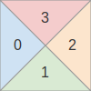
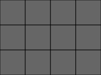
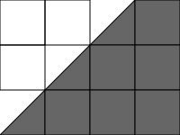
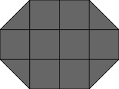
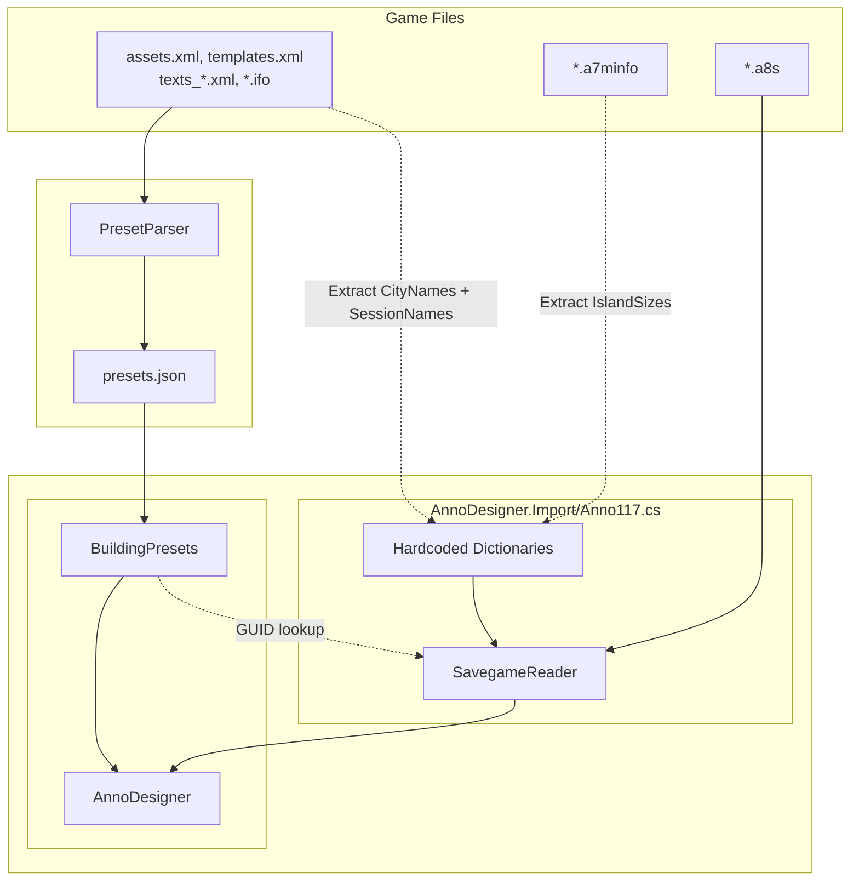

# Anno 117 Savegame Data Format Documentation

> [!IMPORTANT]  
> This documentation is **work in progress** and may be incomplete or subject to change.

## Overview

Anno 117 savegames use a structured binary format that stores all game state information including buildings, infrastructure, and island layouts. This document describes how the game stores data and how to parse it for importing into tools like AnnoDesigner.

## File Structure

### Container Format

Anno 117 savegame files have the extension `.a8s` and are in [RDA file format](https://github.com/lysanntranvouez/RDAExplorer/wiki/RDA-File-Format).

**Key Points:**
- The outer container is `.a8s` (Anno 8)
- Despite the Anno 8 extension, the internal data file is named `data.a7s` (legacy naming)
- The RDA container must be opened and the `data.a7s` file extracted and inflated to access the actual game data

### FileDB Document Structure

The inflated `data.a7s` file is a [FileDB](https://github.com/anno-mods/FileDBReader/wiki/Anno-Fileformats:-compression-version-2-&-3) document with the following hierarchy:

```
MetaGameManager
└── GameSessions
    └── Session (multiple)
        ├── SessionDesc
        │   └── SessionGUID (identifies the session)
        └── SessionData
            └── BinaryData (FileDB document)
                └── GameSessionManager
                    ├── AreaManagers
                    ├── AreaInfo
                    └── MapTemplate
```

## Session Management

### Session Identification

Each game world (e.g., Latium, Albion) is identified by a `SessionGUID`:

```csharp
3245 → "Latium"
6627 → "Albion"
```

### Session Data Parsing

The `SessionData` contains binary data that must be parsed as a nested [FileDB](https://github.com/anno-mods/FileDBReader/wiki/Anno-Fileformats:-compression-version-2-&-3) document.

## Name Resolution

Session and city names were extracted from [`assets.xml`](Anno117_Assets.md) where sessions (regions) are defined as assets:

```xml
<Asset>
  <Template>Region</Template>
  <Values>
    <Standard>
      <GUID>3225</GUID> <!-- GUID of the session -->
      <Name>Region Roman</Name>
    </Standard>
    <Region>
      <CityNames>
        <Item>
          <Name>-6910895826578425784</Name> <!-- LineId for city/island names -->
        </Item>
        <Item>
          <Name>-6903704104905646605</Name>
        </Item>
        ...
      </CityNames>
    </Region>
    <Text>
      <OasisId>-6909366691960942471</OasisId> <!-- LineId for the session -->
    </Text>
  </Values>
</Asset>
```

See [Localization System](Anno117_Assets.md#localization-system) for details on how these names are translated via the `OasisId`/`LineId` system system. The translated names are stored in the hardcoded `SessionNames` and `CityNames` dictionaries in `Anno117.cs`:

```csharp
private static readonly Dictionary<int, SerializableDictionary<string>> SessionNames = 
{
    { 3245, new SerializableDictionary<string> { ["eng"] = "Latium", ... } },
    { 6627, new SerializableDictionary<string> { ["eng"] = "Albion", ... } },
};

private static readonly Dictionary<string, SerializableDictionary<string>> CityNames = 
{
    { "-6910895826578425784", new SerializableDictionary<string> { ["eng"] = "Neapolis", ... } },
    // ...
};
```

## Area/Island Structure

### Area Managers

Each island in the game world has an `AreaManager` identified by an `AreaID`. The `AreaManagers` collection contains all managers:

```
AreaManagers
├── AreaManager_8577
├── AreaManager_9234
└── ...
```

**XML Example:**
```xml
<AreaManagers>
  <AreaManager_8577>
    <!-- Island-specific data -->
  </AreaManager_8577>
</AreaManagers>
```

### Area Information

The `AreaInfo` dictionary provides metadata about each island:

**Key Attributes:**
- `CityName`: Custom name given by player (Unicode string)
- `CityNameGuid`: Default city name identifier (fallback if no custom name)
- `OwnerProfile`: GUID of the profile that owns the island (41 = human player)

**XML Example:**
```xml
<AreaInfo>
  <None>4125</None>
  <None>
	<Fertility>
	  <None>9E080000</None>
	  <None>D10F0000</None>
	  <None>81210000</None>
	  <None>9A080000</None>
	  <None>A0080000</None>
	  <None>9D080000</None>
	</Fertility>
	<CityNameGuid>418AA1203D151DA0</CityNameGuid>
	<OwnerProfile>29000000</OwnerProfile>
	<LastOwnerChangeTime>68BBDC2C00000000</LastOwnerChangeTime>
	<WasEverOwned>01</WasEverOwned>
	<VassalOwner>29000000</VassalOwner>
	<OriginalOwner>81790000</OriginalOwner>
  </None>
</AreaInfo>
```

**City Name Resolution:**

Islands can have either custom player-assigned names or default names. The default names are resolved through the `CityNameGuid` field, which is the `LineId` (Int64) that is used to look up the name in the hardcoded `CityNames` dictionary.

```csharp
string cityName = areaInfo.Attribute("CityName")?.ToUnicode() ?? CityNames[areaInfo.Attribute("CityNameGuid").ToNumber<long>().ToString()];
```

### Map Templates

Map templates define the map information for islands:

**Key Attributes:**

| Attribute | Type | Description | Example |
|-----------|------|-------------|---------|
| `Size` | 2x Int32 | World size dimensions | `9008000090080000` → (2192, 2192) |
| `Position` | 2x Int32 | Island position in world space | `3006000038000000` → (1584, 56) |
| `MapFilePath` | Unicode | Path to island template file (.a7m) | `6400610074006100...` → "data/base/provinces/..." |
| `Rotation90` | Byte | Rotation in 90-degree increments | `02` → 180 degrees |

**XML Example:**
```xml
<MapTemplate>
  <Size>9008000090080000</Size>
  <PlayableArea>14000000180000007C08000080080000</PlayableArea>
  <TemplateElement>
    <Element>
      <Position>3006000038000000</Position>
      <MapFilePath>64006100740061002F0062006100730065002F00700072006F00760069006E006300650073002F...</MapFilePath>
      <Rotation90>02</Rotation90>
      <FertilityGuids>9E080000D10F0000812100009A080000A00800009D080000</FertilityGuids>
      <RandomizeFertilities>00</RandomizeFertilities>
      <MineSlotActivation>
        <None>0400000001006480</None>
        <None>01</None>
      </MineSlotActivation>
      <RandomIslandConfig>
        <value>
          <Type>
            <id>0100</id>
          </Type>
          <Difficulty />
        </value>
      </RandomIslandConfig>
      <FertilitySetGUID>507A0000</FertilitySetGUID>
    </Element>
  </TemplateElement>
</MapTemplate>
```

## Game Objects (Buildings)

Game objects represent all placeable objects in the game. They are stored in the `AreaObjectManager`.

### AreaObjectManager Structure

```
AreaObjectManager
├── GameObjectIDCounter
├── NonGameObjectIDCounter
└── GameObject
    └── objects
        └── (multiple game objects)
```

### GameObject Attributes

Each game object has the following key attributes:

| Attribute | Type | Description | Example |
|-----------|------|-------------|---------|
| `guid` | Int32 | Asset identifier | `1C930000` → 37660 |
| `ID` | Int64 | Unique object ID | `0100000081210000` → 9007270176039936 |
| `Position` | 3x Float32 | World-space X, Z, Y coordinates | `00807A4319F5B4400070F644` → (250.5, 5.655, 1975.0) |
| `Direction` | Float32 | Rotation angle in radians | `DB0F4940` → 3.1415927 |
| `OwnerProfile` | Int32 | Owner profile GUID | `29000000` → 41 |
| `StateBits` | Int32 | Building state flags | See state section |

**XML Example:**
```xml
<GameObject>
  <objects>
    <None>
      <guid>1C930000</guid>
      <ID>0100000081210000</ID>
      <Direction>DB0F4940</Direction>
      <Position>00807A4319F5B4400070F644</Position>
      <OwnerProfile>29000000</OwnerProfile>
      <StateBits>66000000</StateBits>
    </None>
  </objects>
</GameObject>
```

### Position Encoding

Positions are encoded as 12 hex bytes representing three 32-bit little-endian floats (X, Z, Y):

**Example Breakdown:**
```
Position: 00807A4319F5B4400070F644

Bytes:     00 80 7A 43 | 19 F5 B4 40 | 00 70 F6 44
          └─────┬─────┘ └─────┬─────┘ └─────┬─────┘
             X: 250.5      Z: 5.655     Y: 1975.0
```

### State Bits

The `StateBits` field encodes various building states:

| Bit Pattern | State | Visual Effect |
|-------------|-------|---------------|
| `0` | Normal | Standard appearance |
| `102` (0x66) | Blueprint | Blue/transparent background |
| Other values | Under construction, damaged, etc. | Various effects |

## Polygon Objects (Farm Fields)

Polygon objects represent area-based structures like farm fields, and other grid-based objects.

### AreaPolygonObjectManager Structure

```
AreaPolygonObjectManager
├── Polygons
│   └── (multiple polygon objects)
```

### Polygon Object Attributes

| Attribute | Type | Description |
|-----------|------|-------------|
| `GUID` | Int32 | Asset identifier |
| `SubTilesGrid` | Grid | Grid data structure with tile information |
| `ModuleOwner` | ObjectID | ID of the owning building |

**XML Example:**
```xml
<AreaPolygonObjectManager>
  <Polygons>
    <None>00000000</None>
    <None>
      <GUID>7EA10000</GUID>
      <SubTilesGrid>
        <GridOriginWS>9800000014070000</GridOriginWS>
        <Grid>
          <grid>
            <x>84000000</x>
            <y>2C000000</y>
            <bits>000000F0FF0F00000000...</bits>
          </grid>
        </Grid>
      </SubTilesGrid>
      <ModuleOwner>
        <ObjectID>0100000081210000</ObjectID>
      </ModuleOwner>
    </None>
  </Polygons>
</AreaPolygonObjectManager>
```

### SubTilesGrid Structure

The `SubTilesGrid` contains grid-based occupancy data:

**Key Components:**
- `GridOriginWS`: World-space origin point (2×32-bit integers)
- `x`: Bits per row in the `bits` array
- `y`: Number of rows in the `bits` array
- `bits`: Byte array representing tiles

### Processing Tiles Grid

**Code Example:**
```csharp
private static void ProcessTilesGrid(Tag tilesGrid, Action<byte, Point2D<float>> action)
{
    Tag grid = tilesGrid.Tag("Grid").Tags().Single();
    Point2D<int> origin = tilesGrid.Attribute("GridOriginWS").ToPoint2D<int>();
    
    int rows = grid.Attribute("y").ToNumber<int>();
    byte[] bits = grid.Attribute("bits").ToNibbles().ToArray(); // Each nibble is one item in this array (0000|<nibble>)
    int columns = grid.Attribute("x").ToNumber<int>() / 4; // Convert number of bits to number of nibbles
    int stride = bits.Length / rows; // Account for padding
    
    ProcessTilesGrid(bits, columns, rows, stride, origin, action);
}

private static void ProcessTilesGrid(byte[] bits, int width, int height, int stride, 
                                      Point2D<int> origin, Action<byte, Point2D<float>> action)
{
    for (int y = 0; y < height; y++)
    {
        for (int x = 0; x < width; x++)
        {
            byte value = bits[y * stride + x];
            if (value != 0)
            {
                // Calculate center position of the tile
                float tileX = x + origin.X + (TileObject.Size / 2); // TileObject.Size = 1
                float tileY = y + origin.Y + (TileObject.Size / 2);
                action(value, new Point2D<float>(tileX, tileY));
            }
        }
    }
}
```

### Nibble Array Encoding

Each nibble (4-bit value) in the `bits` attribute is one tile:

**Example:**
```
bits: "000000F0FF0F0000..."

Breaking down:
  As nibbles (Little-endian, low nibble first):
  0, 0, 0, 0, 0, 0, 0, F, F, F, F, 0, ...
  
  Position [0,0] = 0 (empty)
  Position [7,0] = F (occupied, variant 0b1111)
  Position [8,0] = F (occupied, variant 0b1111)
```

### Sub-Tile Quadrants

Each nibble value represents a tile's quadrant configuration using 4 bits, where each bit controls one quadrant of the tile. The game divides each tile into four triangular sub-tiles from the center point.

**Bit Layout:**

Each bit corresponds to a triangular quadrant originating from the center of the tile:

- **Bit 0:** Left triangle
- **Bit 1:** Bottom triangle
- **Bit 2:** Right triangle
- **Bit 3:** Top triangle

**Visualization:**



### Sub-Tile Types

The game uses the following quadrant combinations:

#### Empty Tile

| Value | Binary | Bits | Shape | Description |
|-------|--------|------|-------|-------------|
| 0x0 | 0000 | None |  | Empty/unused tile |

#### Single Sub-Tile Triangles (1 bit set)

| Value | Binary | Bits | Shape | Description |
|-------|--------|------|-------|-------------|
| 0x1 | 0001 | L |  | Left triangle only |
| 0x2 | 0010 | B |  | Bottom triangle only |
| 0x4 | 0100 | R |  | Right triangle only |
| 0x8 | 1000 | T |  | Top triangle only |


#### Half-Quad Diagonal Triangles (2 bits set)

| Value | Binary | Bits | Shape | Description |
|-------|--------|------|-------|-------------|
| 0x3 | 0011 | B+L |  | Bottom half-Left (diagonal) |
| 0x6 | 0110 | B+R |  | Bottom-Right half (diagonal) |
| 0x9 | 1001 | T+L |  | Top-Left half (diagonal) |
| 0xC | 1100 | T+R |  | Top-Right half (diagonal) |

#### Quad Missing Single Sub-Tile (3 bits set)

| Value | Binary | Bits | Shape | Description |
|-------|--------|------|-------|-------------|
| 0x7 | 0111 | L+B+R |  | Missing Top triangle |
| 0xB | 1011 | L+B+T |  | Missing Right triangle |
| 0xD | 1101 | L+R+T |  | Missing Bottom triangle |
| 0xE | 1110 | B+R+T |  | Missing Left triangle |

#### Full Quad (4 bits set)

| Value | Binary | Bits | Shape | Description |
|-------|--------|------|-------|-------------|
| 0xF | 1111 | L+B+R+T |  | Full square tile |

### Practical Examples

**Example 1:**
```
Grid:
  F F F F
  F F F F
  F F F F
```


**Example 2:**
```
Grid:
  0 0 6 F
  0 6 F F
  6 F F F
```


**Example 3:**
```
Grid:
  6 F F 3
  F F F F
  C F F 9
```


## Graph-Based Infrastructure

Graph structures represent connected infrastructure like roads, aqueducts, canals, hedges, and walls.

### Manager Types

Each infrastructure type has its own manager within an AreaManager:

```
AreaManager_XXXX
├── AreaStreetManager
├── AreaAqueductManager
├── AreaCanalManager
├── AreaHedgeManager
└── AreaWallManager
```

### Graph Structure

Each manager contains a `Graph` with:

```
Graph
├── Nodes (collection of nodes)
└── Edges (collection of edges)
```

**XML Example:**
```xml
<AreaStreetManager>
  <Graph>
    <Nodes>
      <None>DD010000D10D0000</None>
      <None>
        <Node>
          <Flags>00</Flags>
        </Node>
      </None>
      <None>F7010000370F0000</None>
      <None>
        <Node>
          <Flags>00</Flags>
        </Node>
      </None>
    </Nodes>
    <Edges>
      <None>
        <guid>9A4D0000</guid>
        <Edge>
          <PosMin>DD010000D10D0000</PosMin>
          <PosMax>F7010000370F0000</PosMax>
        </Edge>
      </None>
    </Edges>
  </Graph>
</AreaStreetManager>
```

### Coordinates
- World-space coordinates
- Stored as pairs of 32-bit integers (X, Y)
- **IMPORTANT:** Coordinates are scaled by 2 and must be divided by 2

**Example:**
```
Node: DD010000D10D0000

Bytes:  DD 01 00 00 | D1 0D 00 00
       └─────┬─────┘ └─────┬─────┘
           X: 477       Y: 3537

Actual position: (477/2, 3537/2) = (238.5, 1768.5)
```

### Nodes

Nodes represent endpoints in the graph. Since they are simply starting and ending positions of edges, they are ignored for now. Unsure what `<Flags>` do

### Edges

Edges represent connections between nodes:

**Attributes:**
- `guid`: Asset identifier (road type, aqueduct type, etc.)
- `PosMin`: Starting position (2×32-bit integers)
- `PosMax`: Ending position (2×32-bit integers)

**XML Example:**
```xml
<Edge>
  <guid>9A4D0000</guid>
  <Edge>
    <PosMin>DD010000D10D0000</PosMin>
    <PosMax>F7010000370F0000</PosMax>
  </Edge>
</Edge>
```

### Parsing Graph Data

**Code Example:**
```csharp
private static void ProcessGraph(Tag graph, Action<TileGraph.Tile> action)
{
    IEnumerable<Tag> edges = graph.Tag("Edges").Tags();
    ProcessEdges(edges, action);
}

private static void ProcessEdges(IEnumerable<Tag> edges, Action<TileGraph.Tile> action)
{
    TileGraph graph = new TileGraph();
    
    foreach (Tag edge in edges)
    {
        int guid = edge.Attribute("guid").ToNumber<int>();
        ProcessEdge(guid, graph, edge.Tag("Edge"));
    }
    
    foreach (var tile in graph.Merge())
    {
        action(tile);
    }
}

private static void ProcessEdge(int guid, TileGraph graph, Tag edge)
{
    // IMPORTANT: Positions in Anno 117 graphs are scaled by factor of 2
    Point2D<float> start = edge.Attribute("PosMin").ToPoint2D<int>().Scale(0.5f);
    Point2D<float> end = edge.Attribute("PosMax").ToPoint2D<int>().Scale(0.5f);
    graph.AddEdge(guid, new Line2D<float>(start, end));
}
```

## Data Type Reference

### Common Data Types

| Type | Size | Byte Order | Example |
|------|------|------------|---------|
| Int32 | 4 bytes | Little-endian | `1C930000` → 37660 |
| Int64 | 8 bytes | Little-endian | `0100000081210000` → 9007270176039936 |
| Float32 | 4 bytes | Little-endian IEEE-754 | `00807A43` → 250.5 |
| Point2D&lt;T&gt; | 2× &lt;T&gt; | 2× &lt;T&gt; | Int32 `DD010000D10D0000` → (477, 3537) |
| Point3D&lt;T&gt; | 3× &lt;T&gt; | 3× &lt;T&gt; | Float32 `00807A4319F5B4400070F644` → (250.5, 5.655, 1975.0) |

### Nibble Extraction

Nibbles are 4-bit values packed into bytes in Little-endian order:

```csharp
public static IEnumerable<byte> ToNibbles(this byte[] bytes)
{
    foreach (byte b in bytes)
    {
        yield return (byte)(b & 0x0F); // Low nibble
        yield return (byte)(b >> 4);   // High nibble
    }
}
```

**Example:**
```
Byte: 0xF3
  First nibble:  3 (0x03)
  Second nibble: F (0x0F)
```

## Data Extraction Pipeline

The savegame reader depends on building templates extracted from [`assets.xml`](Anno117_Assets.md) to create the layouts.

**In Assets (`assets.xml`):**

Each building has a unique `<Standard><GUID>` identifier:

```xml
<Asset>
  <Values>
    <Standard>
      <GUID>3087</GUID>
      <Name>Residence Roman 01 Peasants</Name>
    </Standard>
  </Values>
</Asset>
```

**In Savegame (`data.a7s`):**

Buildings are stored with the same GUID as a little-endian 32-bit integer:

```xml
<GameObject>
  <guid>0F0C0000</guid>  <!-- Big-endian: 0x00000C0F → Decimal: 3087 -->
</GameObject>
```

### Data Flow



### Data Consistency Across Systems

| Data Type | Asset Format | Savegame Format | Connection Method |
|-----------|--------------|-----------------|-------------------|
| **Building GUID** | Asset with `<GUID>3087</GUID>` | `<guid>0F0C0000</guid>` | PresetParser: Assets → JSON → AnnoDesigner → Look up `BuildingInfo` already loaded by AnnoDesigner via GUID |
| **Session GUID** | Asset with `<GUID>3245</GUID>` | `<SessionGUID>AD0C0000</SessionGUID>` | Lookup in hardcoded `SessionNames[3245]` |
| **Island Names** | Region assets with `<CityNames>` | `<CityNameGuid>418AA1203D151DA0</CityNameGuid>` | Lookup in hardcoded `CityNames["-6910895826578425784"]` |
| **Building Dimensions** | Extracted from `.ifo` files | Not stored, referenced from presets | PresetParser: BuildBlocker → JSON → AnnoDesigner → Look up `BuildingInfo` already loaded by AnnoDesigner via GUID to to get `BuildBlocker` |
| **Localization** | `LineId` translated via `texts_*.xml` | Not stored in savegame | PresetParser: Assets → JSON → AnnoDesigner → Look up `BuildingInfo` already loaded by AnnoDesigner via GUID to get `Localization` |
